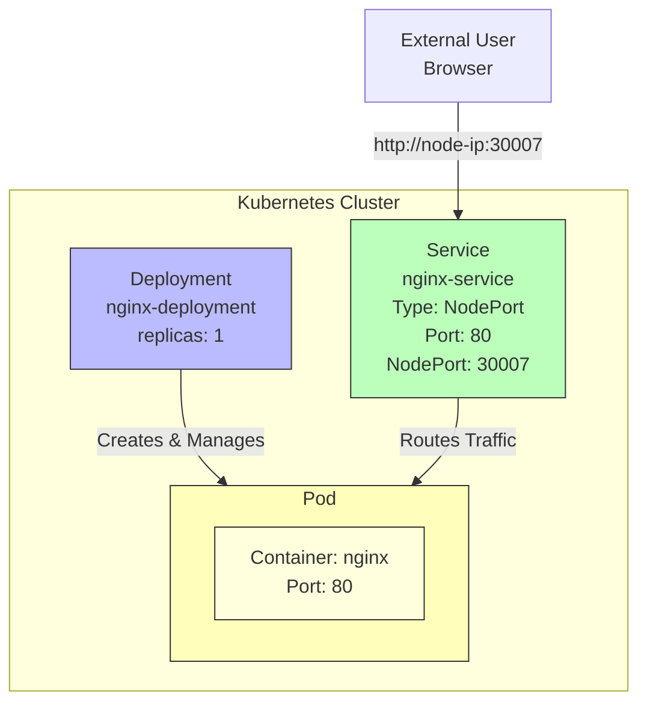

# Kubernetes - Deploy Nginx Web Server

Simple step-by-step guide to deploy and expose an nginx web application on Kubernetes.

## Prerequisites

- Access to [Killercoda Kubernetes Playground](https://killercoda.com/playgrounds/scenario/kubernetes)
- Browser (no installation needed!)

## Quick Start on Killercoda

1. Open [Killercoda Kubernetes Playground](https://killercoda.com/playgrounds/scenario/kubernetes)
2. Wait for the environment to load (30-60 seconds)
3. Terminal will be ready automatically
4. Follow the steps below!

## Architecture



## 🧩 Task 1 — Deploy Nginx Web Server

### Objective
Run nginx web server using Kubernetes Deployment.

### Step 1: Open Killercoda Environment

1. Go to [Killercoda Kubernetes Playground](https://killercoda.com/playgrounds/scenario/kubernetes)
2. Click **"Start"** to launch the environment
3. Wait for the terminal to appear (takes ~30 seconds)

### Step 2: Verify Cluster is Ready

In the Killercoda terminal, run:

```bash
kubectl get nodes
```

**Expected Output:**
```
NAME           STATUS   ROLES           AGE
controlplane   Ready    control-plane   1m
```

✅ If you see `Ready` status, the cluster is ready!

### Step 3: Create Deployment File

In Killercoda terminal, create the deployment file:

```bash
cat > deployment.yml <<EOF
apiVersion: apps/v1
kind: Deployment
metadata:
  name: nginx-deployment
spec:
  replicas: 1
  selector:
    matchLabels:
      app: nginx
  template:
    metadata:
      labels:
        app: nginx
    spec:
      containers:
      - name: nginx
        image: nginx
        ports:
        - containerPort: 80
EOF
```

### Step 4: Apply Deployment

```bash
kubectl apply -f deployment.yml
```

**Output:**
```
deployment.apps/nginx-deployment created
```

### Step 5: Check Deployment
Create Service File

In Killercoda terminal, create the service file:

```bash
cat > service.yml <<EOF
apiVersion: v1
kind: Service
metadata:
  name: nginx-service
spec:
  type: NodePort
  selector:
    app: nginx
  ports:
  - port: 80
    targetPort: 80
    nodePort: 30007
EOF
```

### Step 2: Apply Service

```bash
kubectl apply -f service.yml
```

**Output:**
```
service/nginx-service created
```

### Step 3: Check Service

```bash
kubectl get svc
```

**Expected Output:**
```
NAME            TYPE       CLUSTER-IP      EXTERNAL-IP   PORT(S)        AGE
nginx-service   NodePort   10.96.123.45    <none>        80:30007/TCP   10s
```

✅ Service is running on port 30007!

### Step 4: Get Service Details

```bash
kubectl describe service nginx-service
```

Look for the `Endpoints` section - it should show your pod's IP.

### Step 5: Access the Application on Killercoda

**Method 1: Using Traffic/Ports Tab** (Recommended)
1. Look at the top of Killercoda terminal
2. Click the **"Traffic / Ports"** button or tab
3. You'll see port 30007 listed
4. Click on it to open nginx in a new tab

**Method 2: Using the Plus (+) Icon**
1. Click the **"+"** icon next to the terminal tabs
2. Select **"View HTTP port 30007"**
3. Nginx welcome page will open

**Method 3: Using curl in Terminal**
```bash
curl http://localhost:30007
```

**Expected Output:**
You should see the default nginx HTML or the nginx welcome page!

```html
<!DOCTYPE html>
<html>
<head>
<title>Welcome to nginx!</title>
...
```
**Output:**
```
service/nginx-service created
```

### Step 2: Check Service

```bash
kubectl get svc
```

**Expected Output:** (Killercoda)

Follow this exact order during presentation:

### 1️⃣ Open Killercoda
```
Go to: https://killercoda.com/playgrounds/scenario/kubernetes
Click "Start"
```

### 2️⃣ Verify Cluster
```bash
kubectl get nodes
```

### 3️⃣ Create Deployment File
```bash
cat > deployment.yml <<EOF
apiVersion: apps/v1
kind: Deployment
metadata:
  name: nginx-deployment
spec:
  replicas: 1
  selector:
    matchLabels:
      app: nginx
  template:
    metadata:
      labels:
        app: nginx
    spec:
      containers:
      - name: nginx
        image: nginx
        ports:
        - containerPort: 80
EOF
```

### 4️⃣ Apply Deployment
```bash
kubectl apply -f deployment.yml
```

### 5️⃣ Check Pods are Running
```bash
kubectl get pods
```

### 6️⃣ Create Service File
```bash
cat > service.yml <<EOF
apiVersion: v1
kind: Service
metadata:
  name: nginx-service
spec:
  type: NodePort
  selector:
    app: nginx
  ports:
  - port: 80
    targetPort: 80
    nodePort: 30007
EOF
```

### 7️⃣ Apply Service
```bash
kubectl apply -f service.yml
```

### 8️⃣ Check Service
```bash
kubectl get svc
```

### 9️⃣ Access Application
```
Click "Traffic/Ports" → Select port 30007
OR
curl http://localhost:30007
```

## 🎯 Complete Flow

Follow this exact order during presentation:

### 1️⃣ Create Deployment
```bash
kubectl apply -f deployment.yml
```

### 2️⃣ Check Pods are Running
```bash
kubectl get pods
```

### 3️⃣ Create Service
```bash
kubectl apply -f service.yml
```

### 4️⃣ Check Service
```bash
kubectl get svc
```

### 5️⃣ Access Application
```bash
# Killercoda: Use Traffic/Ports tab, access port 30007
# Minikube: minikube service nginx-service
# Cloud: curl http://<node-ip>:30007
```

---

## 📋 Useful Commands

### View All Resources
```bash
kubectl get all
```

### View Pod Logs
```bash
kubectl logs <pod-name>
```

### Describe Pod (Debugging)
```bash
kubectl describe pod <pod-name>
```

### Describe Service
```bash
kubectl describe service nginx-service
```

### Get Endpoints
```bash
kubectl get endpoints
```

### Delete Resources
```bash
kubectl delete -f deployment.yml
kubectl delete -f service.yml
```

Or delete by name:
```bash
kubectl delete deployment nginx-deployment
kubectl delete service nginx-service
```

---

## 🔍 Understanding the Components

### Deployment
- **Purpose:** Manages pods and ensures desired state
- **Replicas:** Number of pod copies (1 in this case)
- **Selector:** Identifies which pods to manage
- **Template:** Defines pod specification

### Service (NodePort)
- **Purpose:** Exposes pods to external traffic
- **Type:** NodePort (accessible on each node's IP)
- **Port:** 80 (service port inside cluster)
- **TargetPort:** 80 (container port)
- **NodePort:** 30007 (external access port)

### Pod
- **Purpose:** Smallest deployable unit in Kubernetes
- **Container:** nginx image running inside
- **Port:** 80 (nginx default HTTP port)

---
