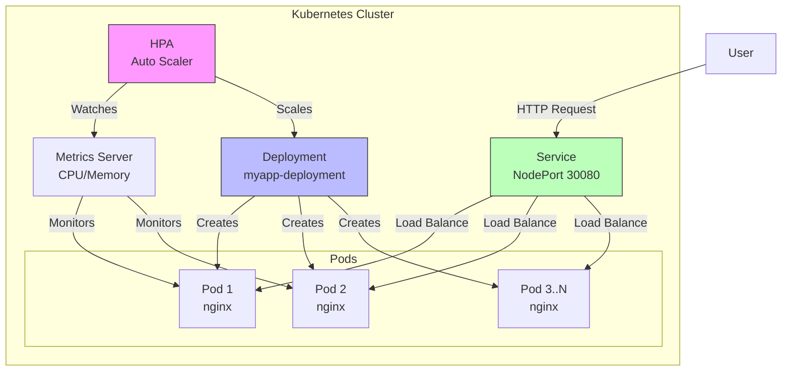
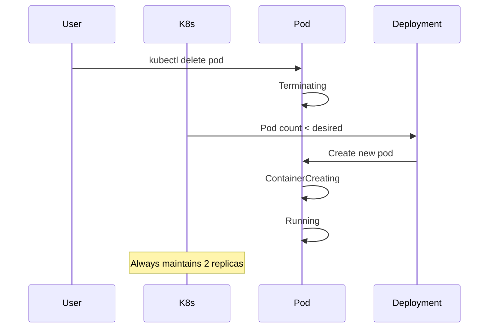
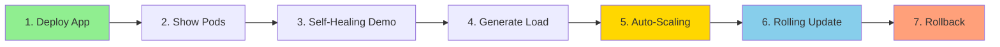

# Kubernetes Demo - Self Healing & Auto Scaling

A complete hands-on demo showing Kubernetes core features: Deployment, Self-Healing, Auto-Scaling, Rolling Updates, and Rollbacks.

## Architecture



## What You'll Learn

- ✅ Deploy applications to Kubernetes
- ✅ Self-healing when pods crash
- ✅ Horizontal auto-scaling based on CPU
- ✅ Rolling updates with zero downtime
- ✅ Rollback to previous versions

## Quick Start (Killercoda)

### 1️⃣ Setup Environment

Open [Killercoda Kubernetes Playground](https://killercoda.com/playgrounds/scenario/kubernetes)

Check cluster is ready:
```bash
kubectl get nodes
```

Expected output:
```
NAME           STATUS   ROLES           AGE
controlplane   Ready    control-plane   1m
```

### 2️⃣ Install Metrics Server

Required for auto-scaling:
```bash
kubectl apply -f https://github.com/kubernetes-sigs/metrics-server/releases/latest/download/components.yaml
```

Wait for it to be ready:
```bash
kubectl get deployment metrics-server -n kube-system
```

### 3️⃣ Deploy Application

Apply all manifests:
```bash
kubectl apply -f deployment.yml
kubectl apply -f service.yml
kubectl apply -f hpa.yml
```

Verify everything is running:
```bash
kubectl get all
```

## Demo Scenarios

### 🔧 Demo 1: Self-Healing

**Concept:** Kubernetes automatically recreates crashed pods.

**Steps:**

1. Watch pods in real-time:
```bash
kubectl get pods -w
```

2. Open another terminal and delete a pod:
```bash
kubectl delete pod <pod-name>
```

**What happens:**


**Expected Result:** New pod automatically created within seconds.

### 📈 Demo 2: Auto-Scaling

**Concept:** HPA scales pods based on CPU usage.

**Steps:**

1. Watch HPA in one terminal:
```bash
kubectl get hpa -w
```

2. Generate load in another terminal:
```bash
kubectl run -i --tty load-generator --rm --image=busybox --restart=Never -- /bin/sh
```

3. Inside busybox, run:
```bash
while true; do wget -q -O- http://myapp-service; done
```

**What happens:**
```
Initial:  TARGETS: 20%/60%  REPLICAS: 2
After 1m: TARGETS: 80%/60%  REPLICAS: 4
After 2m: TARGETS: 95%/60%  REPLICAS: 7
```

4. Stop load (Ctrl+C) and watch it scale down after 5 minutes.

### 🔄 Demo 3: Rolling Update

**Concept:** Update application with zero downtime.

**Steps:**

1. Update nginx to latest version:
```bash
kubectl set image deployment/myapp-deployment myapp=nginx:latest
```

2. Watch the rollout:
```bash
kubectl rollout status deployment/myapp-deployment
```

**What happens:**
- Old pods terminate one by one
- New pods created with new image
- Service continues running throughout

### ⏪ Demo 4: Rollback

**Concept:** Quickly revert to previous version if issues occur.

**Steps:**

1. View rollout history:
```bash
kubectl rollout history deployment/myapp-deployment
```

2. Rollback to previous version:
```bash
kubectl rollout undo deployment/myapp-deployment
```

3. Check status:
```bash
kubectl rollout status deployment/myapp-deployment
```

## Useful Commands

### Monitoring
```bash
# Check all resources
kubectl get all

# Watch pods live
kubectl get pods -w

# Check CPU/Memory usage
kubectl top pods

# View cluster events
kubectl get events --sort-by='.lastTimestamp'
```

### Debugging
```bash
# Pod logs
kubectl logs <pod-name>

# Pod details
kubectl describe pod <pod-name>

# Enter pod shell
kubectl exec -it <pod-name> -- /bin/bash

# Service endpoints
kubectl get endpoints
```

### Cleanup
```bash
# Delete everything
kubectl delete -f deployment.yml
kubectl delete -f service.yml
kubectl delete -f hpa.yml
```

## Configuration Details

### Deployment Features
- **Replicas:** 2 (minimum)
- **Image:** nginx
- **Health Checks:** 
  - Liveness probe (restarts unhealthy pods)
  - Readiness probe (removes from service if not ready)
- **Resource Limits:**
  - Request: 100m CPU, 128Mi RAM
  - Limit: 500m CPU, 512Mi RAM

### Auto-Scaling Rules
- **Min Replicas:** 2
- **Max Replicas:** 10
- **Trigger:** CPU > 60%

### Service Access
- **Type:** NodePort
- **Port:** 80
- **NodePort:** 30080
- **Access:** `http://<node-ip>:30080`

## Bootcamp Presentation Flow (15 min)



### Speaking Script

1. **Deploy** - "Let me deploy a simple nginx application with 2 replicas"
2. **Show** - "We have 2 pods running, load balanced by a service"
3. **Kill Pod** - "Now I'll delete one pod and watch Kubernetes recreate it automatically"
4. **Load** - "Let's generate some traffic to increase CPU usage"
5. **Scale** - "Watch as HPA automatically scales from 2 to 10 pods based on demand"
6. **Update** - "I'll update to latest nginx version with zero downtime"
7. **Rollback** - "If there's an issue, we can instantly rollback"

## Troubleshooting

### Metrics Server Not Ready
```bash
kubectl patch deployment metrics-server -n kube-system --type='json' -p='[{"op": "add", "path": "/spec/template/spec/containers/0/args/-", "value": "--kubelet-insecure-tls"}]'
```

### HPA Shows "unknown" CPU
Wait 1-2 minutes for metrics to populate:
```bash
kubectl top pods
```

### Pods Not Scaling
Check HPA status:
```bash
kubectl describe hpa myapp-hpa
```

## Resources

- [Kubernetes Documentation](https://kubernetes.io/docs/)
- [HPA Guide](https://kubernetes.io/docs/tasks/run-application/horizontal-pod-autoscale/)
- [Killercoda Playground](https://killercoda.com/playgrounds)

---

**Made for DevOps Bootcamp** 🚀
